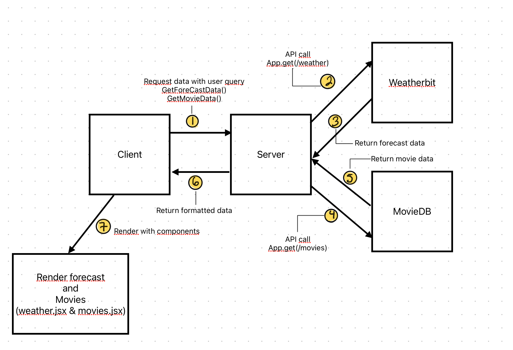

# City Explorer

**Author**: Melo Gonzalez
**Version**: 1.0.0 (increment the patch/fix version number if you make more commits past your first submission)

## Overview

Application allows user to input name of city and display corresponding map.

## Getting Started

### Requirements

For development, you will only need Node.js installed on your environment.
And please use the appropriate [Editorconfig](http://editorconfig.org/) plugin for your Editor (not mandatory).

#### Node

[Node](http://nodejs.org/) is really easy to install & now include [NPM](https://npmjs.org/).
You should be able to run the following command after the installation procedure
below.

    $ node --version
    v0.10.24

    $ npm --version
    1.3.21

### Install

    git clone https://github.com/ORG/PROJECT.git
    cd PROJECT
    npm install

### Configure app

Any environment configuration steps.

### Start & watch

    npm run dev
    npm start

### Simple build for production

    npm run build

## Architecture

### Data Flow

Data Flow Lab 06  
Data Flow Lab 07   
Data Flow Lab 08   

### Languages & tools

Tools used were React Bootstrap, HTML, CSS, Axios, and LocationIQ API

### Lighthouse Scores

LightHouse Score 10-18-2023 

## Change Log

### 10-27-2023 - Lab 09

Name of feature: Lab 09 - Componentize - create movie and weather day component

Estimate of time needed to complete: 2 hrs

Start time: 12:00 pm

Finish time: 1:00 pm

Actual time needed to complete: 1 hour

### 10-24-2023 - Lab 08

Name of feature: Lab 08 - Connect to local server API's moviesDB and weatherBit

Estimate of time needed to complete: 2 hrs

Start time: 8:00 am

Finish time: 9:00 am

Actual time needed to complete: 1 hour 30 minutes

### 10-23-2023 - Lab 08

Name of feature: Lab 08 - Connect to local server API's moviesDB and weatherBit

Estimate of time needed to complete: 2 hrs

Start time: 5:30pm am

Finish time: 6:00 pm

Actual time needed to complete: 30 minutes

### 10-18-2023 - Lab 07

Name of feature: Lab 07 - Connect to local server API

Estimate of time needed to complete: 5 hrs

Start time: 8:30 am

Finish time: 1:30 pm

Actual time needed to complete: 5 hrs

### 10-11-2023 - Lab 06

Name of feature: Lab 06 - Render error messages and refactor code

Estimate of time needed to complete: 5 hrs

Start time: 9:00 am

Finish time: 3:00 pm

Actual time needed to complete: 6 hrs

### 10-10-2023

Name of feature: Establish form and link to API

Estimate of time needed to complete: 5 hrs

Start time: 9:00 am

Finish time: 3:00 pm

Actual time needed to complete: 6 hrs

### 10-09-2023

Name of feature: Setting up

Estimate of time needed to complete: 1 hr

Start time: 10:00 am

Finish time: 12:30 pm

Actual time needed to complete: 2 1/2 hrs

## Credit and Collaborations

Chat GPT  
